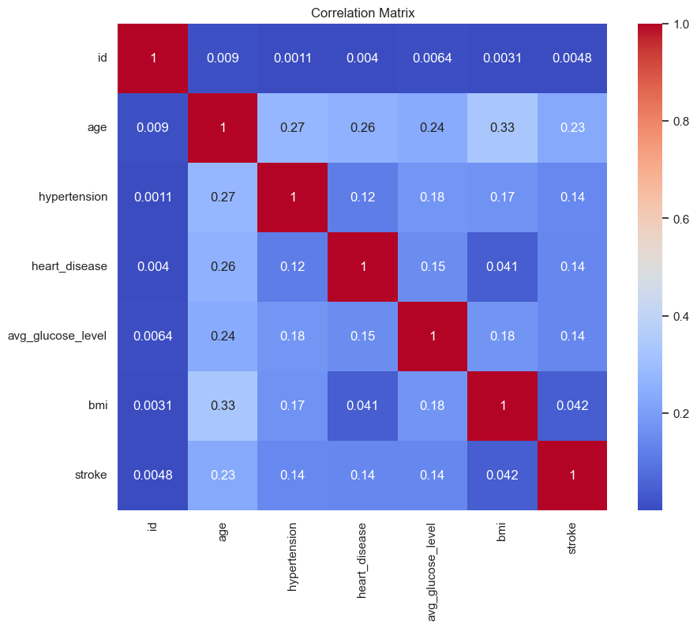
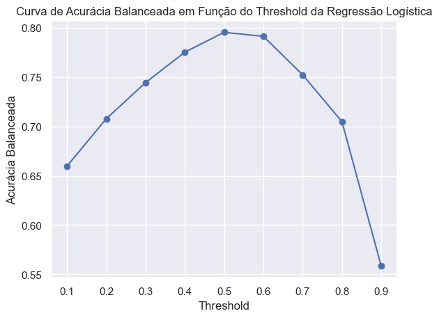
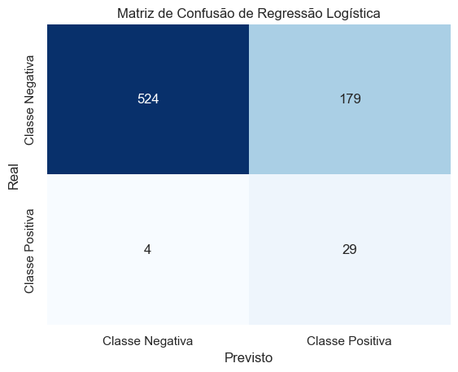

# Predição de AVC Utilizando Modelos de Aprendizado Supervisionado

## Descrição Geral
Este projeto tem como objetivo modelar classificadores binários para a predição de AVC (*Acidente Vascular Cerebral*), utilizando **Regressão Logística** e **Random Forest**. A análise considera a complexidade dos dados desbalanceados, variáveis demográficas e condições de saúde, empregando técnicas avançadas de pré-processamento, ajuste de hiperparâmetros e otimização de limiares. O projeto é uma contribuição relevante para a área de saúde pública, onde a detecção precoce de riscos pode salvar vidas.

---

## Metodologia

### **1. Conjunto de Dados**
- Dados obtidos do [Kaggle](https://www.kaggle.com/datasets/fedesoriano/stroke-prediction-dataset).
- Composição:
  - 5110 observações com 12 variáveis, incluindo idade, hipertensão, doenças cardíacas e status de tabagismo.
  - Variável alvo (`stroke`): 0 (sem AVC) ou 1 (com AVC).
  - **Desbalanceamento:** ~95% da classe negativa.

### **2. Técnicas Utilizadas**
#### **Modelos:**
- **Regressão Logística:** Modelo linear probabilístico aplicado a classificação binária.
- **Random Forest:** Ensemble de árvores de decisão com técnicas como bagging e seleção aleatória de atributos.

#### **Pré-processamento:**
- Exclusão de variáveis irrelevantes (`id`) e valores ausentes (`bmi`).
- Escalonamento de variáveis numéricas com *StandardScaler*.
- Codificação de variáveis categóricas usando *OneHotEncoder*.
- **Separação dos dados por Holdout**

#### **Otimização:**
- **Optuna** foi utilizado para ajuste dos hiperparâmetros, incluindo:
  - Regressão Logística: Parâmetro de regularização `C`.
  - Random Forest: Número de árvores (`n_estimators`), profundidade máxima (`max_depth`), e pesos das classes (`class_weight`).
- Ajuste de limiares de decisão para maximizar métricas como *Recall* e *AUC*.

---

##  Resultados
### **Estatísticas e Correlação**
Análise descritiva e correlação entre variáveis:

### **Ajuste de Limiar**
Para lidar com o desbalanceamento, os limiares foram ajustados:
- **Regressão Logística:** Limiar ajustado para `0.51`.
- **Random Forest:** Limiar ajustado para `0.251`.

### **Matrizes de Confusão**
Desempenho comparativo dos modelos:
- **Regressão Logística:**
  
- **Random Forest:**
  

### **Métricas de Desempenho**
| Métrica                | Regressão Logística | Random Forest |
|------------------------|---------------------|---------------|
| **AUC**               | 0.8593             | 0.8725        |
| **Acurácia Balanceada**| 0.8121             | 0.8431        |
| **Acurácia Geral**     | 0.7514             | 0.7554        |
| **Recall**             | 0.8788             | 0.9394        |

---

##  Conclusões
- **Random Forest** apresentou melhor desempenho geral, especialmente em termos de *Recall*, essencial para problemas em saúde pública.
- O ajuste cuidadoso de hiperparâmetros e limiares foi fundamental para melhorar o desempenho dos modelos em dados desbalanceados.

---

##  Estrutura do Repositório
- **`data/`**: Conjunto de dados utilizados no projeto.
- **`images/`**: Imagens e gráficos gerados durante o experimento.
- **`project/`**: Código principal em Jupyter Notebook.
- **`Full Experiment Report/`**: Relatório completo do experimento.
- **`README.md`**: Documento descritivo do projeto.

---
